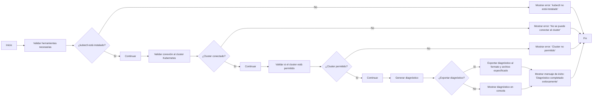

# Kuma Diagnoser

## Descripción

**Kuma Diagnoser** es una herramienta diseñada para validar herramientas necesarias y clusters conectados en un entorno Kubernetes. Proporciona mensajes amigables y detallados sobre el estado de las validaciones realizadas, ayudando a diagnosticar problemas en el entorno.

---

## Estructura del Proyecto

```plaintext
.
├── README.md
├── cmd
│   ├── check.go
│   ├── export.go
│   └── portforward.go
├── internal
│   ├── analyzer.go
│   ├── exporter.go
│   ├── portforward.go
│   ├── utils.go
│   └── validation.go
├── kuma-diagnoser
├── main.go
├── config.yaml
├── go.mod
├── go.sum
```

---

## Instalación

### Prerrequisitos

- Tener instalado **Go** (1.20 o superior).
- Tener acceso a un cluster de Kubernetes configurado con **kubectl**.

### Pasos

1. Clona el repositorio:

    ```bash
    git clone https://github.com/Portfolio-jaime/kuma-diagnoser.git
    cd kuma-diagnoser
    ```

2. Compila la herramienta:

    ```bash
    go build -o kuma-diagnoser main.go
    ```

3. Mueve el binario a un directorio en tu PATH, por ejemplo:

    ```bash
    sudo mv kuma-diagnoser /usr/local/bin/
    ```

4. Verifica la instalación:

    ```bash
    kuma-diagnoser version
    ```

---

## Uso

### Comando Básico

```bash
kuma-diagnoser check
```

### Opciones

- `--output`: Especifica el archivo de salida.
- `--format`: Formato de salida (json, yaml, md).
- `--config`: Especifica el archivo de configuración con clusters permitidos.
- `--allowed-clusters`: Lista de clusters permitidos (si no se usa `--config`).

### Ejemplos

1. **Verificación rápida**:

    ```bash
    kuma-diagnoser check
    ```

2. **Exportar diagnóstico a archivo**:

    ```bash
    kuma-diagnoser export --format md --output diag.md
    ```

3. **Reenviar puertos para acceso a servicios**:

    ```bash
    kuma-diagnoser port-forward
    ```

4. **Usar un archivo de configuración específico**:

    ```bash
    kuma-diagnoser check --config=config.yaml
    ```

---

## Mensajes de Validación

### Herramientas necesarias:

- ✅ `kubectl` está instalado.
- ❌ `kubectl` no está instalado.

### Cluster conectado:

- ✅ Cluster `'nexus-infradev-eks-cluster'` validado exitosamente.
- ❌ Contexto `kubectl` actual `'arn:aws:eks:...'` no está entre clusters permitidos.

### Mensaje Final:

Si todas las validaciones pasan exitosamente, se muestra un mensaje de éxito.

---

## Contribución

1. Haz un fork del repositorio.
2. Crea una nueva rama:

    ```bash
    git checkout -b feature/nueva-caracteristica
    ```

3. Realiza tus cambios y haz commit:

    ```bash
    git commit -am 'Agrega nueva caracteristica'
    ```

4. Haz push a la rama:

    ```bash
    git push origin feature/nueva-caracteristica
    ```

5. Crea un nuevo Pull Request.

---

## Licencia

Este proyecto está bajo la Licencia MIT. Consulta el archivo `LICENSE` para más detalles.

---

## Contacto

Para preguntas o comentarios, abre un issue en el repositorio o contacta a los mantenedores del proyecto.

---

## Diagrama de Flujo

```plaintext
Inicio
  ↓
Validar herramientas necesarias
  ↓
¿Herramientas válidas?
  → No: Mostrar error y detener ejecución
  → Sí: Continuar
  ↓
Validar cluster conectado
  ↓
¿Cluster permitido?
  → No: Mostrar error y detener ejecución
  → Sí: Continuar
  ↓
Mostrar mensaje de éxito
Fin
```

@startuml
left to right direction
start
:Validar herramientas necesarias;
if (¿kubectl está instalado?) then (No)
  :Mostrar error: "kubectl no está instalado.";
  stop
else (Sí)
  :Continuar;
endif
:Validar conexión al cluster Kubernetes;
if (¿Cluster conectado?) then (No)
  :Mostrar error: "No se puede conectar al cluster.";
  stop
else (Sí)
  :Continuar;
endif
:Validar si el cluster está permitido;
if (¿Cluster permitido?) then (No)
  :Mostrar error: "Cluster no permitido.";
  stop
else (Sí)
  :Continuar;
endif
:Generar diagnóstico;
if (¿Exportar diagnóstico?) then (Sí)
  :Exportar diagnóstico al formato y archivo especificado;
else (No)
  :Mostrar diagnóstico en consola;
endif
:Mostrar mensaje de éxito: "Diagnóstico completado exitosamente.";
stop
@enduml



---

## Mantenimiento

Para mantener el proyecto actualizado:

- Ejecuta `go mod tidy` para limpiar y actualizar las dependencias de Go.

---

¡Gracias por usar **Kuma Diagnoser**! Tu herramienta para un Kubernetes saludable.
